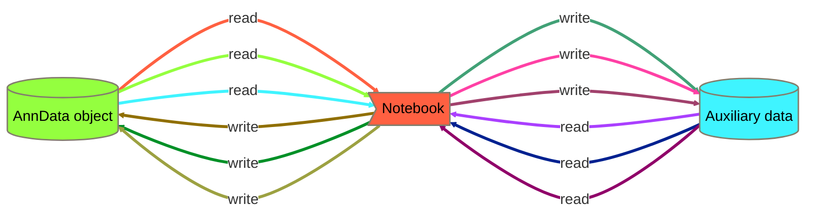

# FCA_Fetal_Skin_priv
Private repo for the preparation of the fetal skin manuscript

See [description of contents](toc.md)

## Data Science Pipeline

For higher resolution, expand the diagram and zoom in. ctrl+click on the name of the file of interest, if available, you will be redirected. 

```mermaid
flowchart TB
	%%{init: {'securityLevel' : 'loose', 'flowchart': {'curve': 'basis', 'nodeSpacing':60, 'diagramPadding':100}, 'themeVariables': {'nodeBorder':'#837E6D', 'fontSize': '60px', 'clusterBkg':'#FBD15F', 'clusterBorder':'#000'}}}%%
	classDef red color:#000,fill:#FF6041,stroke-width:8px
	classDef anti_red_0 color:#000,fill:#94FF3F,stroke-width:8px
	classDef anti_red_1 color:#000,fill:#3FF4FF,stroke-width:8px
	classDef anti_red_2 color:#FFF,fill:#AA3FFF,stroke-width:8px
	classDef blue color:#FFF,fill:#002190,stroke-width:8px
	classDef anti_blue_0 color:#FFF,fill:#900069,stroke-width:8px
	classDef anti_blue_1 color:#000,fill:#906F00,stroke-width:8px
	classDef anti_blue_2 color:#000,fill:#009027,stroke-width:8px
	classDef mustard color:#000,fill:#9CA141,stroke-width:8px
	classDef anti_mustard_0 color:#000,fill:#41A176,stroke-width:8px
	classDef anti_mustard_1 color:#000,fill:#FF40A5,stroke-width:8px
	classDef anti_mustard_2 color:#000,fill:#A1416C,stroke-width:8px
	classDef black color:#fff,fill:#000,stroke-width:8px
	subgraph FCA Data Science Pipeline
		subgraph figures
			subgraph pre-processing for figures
				subgraph Data Post-Processing
					L_2>3_remove_doublets.ipynb]:::red
					click L_2 "https://github.com/haniffalab/FCA_Fetal_Skin_priv/blob/main/code/notebooks/analysis/3_remove_doublets.ipynb"
					click L_2_1_present "https://github.com/haniffalab/FCA_Fetal_Skin_priv/blob/main/data/20200112_fetal_skin_rachel_annotation.tsv"
					L_2_1_present[(**/20200112_fetal_skin_rachel_annotation.tsv)]:::anti_red_1
					L_2_3_ambiguous[(**/fetal_skin.*.processed.20191205.h5ad)]:::anti_red_0
					click L_2_2_present "https://github.com/haniffalab/FCA_Fetal_Skin_priv/blob/main/data/20200112_fetal_skin_rachel_markers.tsv"
					L_2_2_present[(**/20200112_fetal_skin_rachel_markers.tsv)]:::anti_red_1
					L_2_7_present[(**/fetal_skin_hierarch2_monocyte_processed.h5ad)]:::anti_red_0
					L_2_9_ambiguous[(**/fetal_skin.*.doublet_removed_processed.20200114.h5ad)]:::anti_red_0
					M_2>4_remake_global_umap.ipynb]:::red
					click M_2 "https://github.com/haniffalab/FCA_Fetal_Skin_priv/blob/main/code/notebooks/analysis/4_remake_global_umap.ipynb"
					M_2_7_present[(**/fetal_skin.processed.20200829.h5ad)]:::anti_red_0
					M_2_5_present[(**/fetal_skin.norm.20200829.h5ad)]:::anti_red_0
					M_2_2_present[(**/fetal_skin.annotated.metadata.20200720.csv)]:::anti_red_1
					M_2_3_ambiguous[(**/cc_genes.list)]:::anti_red_1
					M_2_10_present[(**/fetal_skin.independent_annot_celltypes.20200829.tsv)]:::anti_red_1
					M_2_14_present[(**/fetal_skin.processed.downsampled.20200829.h5ad)]:::anti_red_0
					M_2_1_present[(**/fetal_skin_bbknn.annotated.20200626.h5ad)]:::anti_red_0
					M_2_8_present[(**/fetal_skin.annotation.20200829.tsv)]:::anti_red_1
					M_2_11_present[(**/fetal_skin.annotation_with_UMAP.20200829.tsv)]:::anti_red_1
					N_2>5.1_make_final_object.ipynb]:::red
					click N_2 "https://github.com/haniffalab/FCA_Fetal_Skin_priv/blob/main/code/notebooks/analysis/5.1_make_final_object.ipynb"
					O_2_3_present[(**/fetal_skin.*.cellxgene.20211215.h5ad)]:::anti_red_0
					N_2_11_present[(**/fetal_skin.norm.maternal_removed.downsampled_rnd200.20211208.h5ad)]:::anti_red_0
					N_2_3_present[(**/maternal_barcodes.csv)]:::anti_red_1
					N_2_2_present[(**/fetal_skin.lymphoid_T_NK.doublet_removed_processed.20210423.h5ad)]:::anti_red_0
					N_2_1_present[(**/fetal_skin.norm.20210401.h5ad)]:::anti_red_0
					O_2_1_present[(**/fetal_skin.norm.maternal_removed.20211215.h5ad)]:::anti_red_0
					N_2_8_present[(**/cell_counts_by_sample_celltype.20211215.csv)]:::anti_red_1
					N_2_12_present[(**/fetal_skin.norm.maternal_removed.downsampled_rnd200.20211215.obs.tsv)]:::anti_red_1
					N_2_7_present[(**/cell_counts_by_donor_sorting_celltype.20211215.csv)]:::anti_red_1
					N_2_13_present[(**/fetal_skin.norm.maternal_removed.downsampled_by_joint_annotation_rnd100.20211215.h5ad)]:::anti_red_0
					N_2_14_present[(**/fetal_skin.norm.maternal_removed.downsampled_by_joint_annotation_rnd100.lognorm.pkl)]:::anti_red_1
					N_2_10_present[(**/fetal_skin.norm.maternal_removed.downsampled_rnd200.20211215.h5ad)]:::anti_red_0
					N_2_9_present[(**/fetal_skin.norm.maternal_removed.20211215.obs.csv.gz)]:::anti_red_1
					O_2>5.2_make_final_object2.ipynb]:::red
					click O_2 "https://github.com/haniffalab/FCA_Fetal_Skin_priv/blob/main/code/notebooks/analysis/5.2_make_final_object2.ipynb"
					O_2_5_present[(**/fetal_skin.*.cellxgene.*.h5ad)]:::anti_red_0
					O_2_3_present[(**/fetal_skin.*.cellxgene.20211215.h5ad)]:::anti_red_0
					O_2_1_present[(**/fetal_skin.norm.maternal_removed.20211215.h5ad)]:::anti_red_0
					O_2_2_present[(**/fetal_skin.norm.maternal_removed.*.h5ad)]:::anti_red_0
					P_2>5.3_make_final_object3.ipynb]:::red
					click P_2 "https://github.com/haniffalab/FCA_Fetal_Skin_priv/blob/main/code/notebooks/analysis/5.3_make_final_object3.ipynb"
					P_2_1_present[(**/fetal_skin.norm.maternal_removed.20220201.h5ad)]:::anti_red_0
					P_2_8_present[(**/fetal_skin.*.cellxgene.20220201.h5ad)]:::anti_red_0
					P_2_10_present[(**/fetal_skin.*.cellxgene.20220202.h5ad)]:::anti_red_0
					Y_4_1_present[(**/fetal_skin.norm.maternal_removed.20220202.h5ad)]:::anti_red_0
					P_2_4_present[(**/figS1B_a.pdf)]:::anti_red_1
					P_2_5_present[(**/figS1B_c.pdf)]:::anti_red_1
					P_2_11_present[(**/fetal_skin.TREM2_macrophage.count.h5ad)]:::anti_red_0
					P_2_6_present[(**/figS1B_b.pdf)]:::anti_red_1
				end
				Q_3>integrate_rie20.ipynb]:::red
				click Q_3 "https://github.com/haniffalab/FCA_Fetal_Skin_priv/blob/main/code/notebooks/figures/integrate_rie20.ipynb"
				Q_3_1_present[(**/pooled_keratinocytes.processed.h5ad)]:::anti_red_0
				Q_3_8_present[(**/rie20.raw.h5ad)]:::anti_red_0
				click Q_3_4_present "https://github.com/haniffalab/FCA_Fetal_Skin_priv/blob/main/data/G2-M_genes.list"
				Q_3_4_present[(**/G2-M_genes.list)]:::anti_red_1
				click Q_3_3_present "https://github.com/haniffalab/FCA_Fetal_Skin_priv/blob/main/data/G1-S_genes.list"
				Q_3_3_present[(**/G1-S_genes.list)]:::anti_red_1
				click Q_3_19_present "https://github.com/haniffalab/FCA_Fetal_Skin_priv/blob/main/data/JP_cycle_genes.list"
				Q_3_19_present[(**/JP_cycle_genes.list)]:::anti_red_1
				Q_3_11_present[(**/rie20.harmony.processed.h5ad)]:::anti_red_0
				Q_3_21_present[(**/figS2E_integrate_adult_fetal_hair_follicle.pdf)]:::anti_red_1
				Q_3_14_present[(**/fsk_org_KC_joint_annot.lognorm.pkl)]:::anti_red_1
				Q_3_17_present[(**/figS2D.20220928.pdf)]:::anti_red_1
				Q_3_15_present[(**/fsk_KC_joint_annot.lognorm.pkl)]:::anti_red_1
				Q_3_16_present[(**/org_KC_joint_annot.lognorm.pkl)]:::anti_red_1
				Y_4_5_present[(**/rie20_lognorm.pkl)]:::anti_red_1
				Q_3_20_present[(**/figS2D_matrix_DEG.20221021.pdf)]:::anti_red_1
				Q_3_18_present[(**/figS2D.20220923.pdf)]:::anti_red_1
				R_3>Compare_to_Bian20.ipynb]:::red
				click R_3 "https://github.com/haniffalab/FCA_Fetal_Skin_priv/blob/main/code/notebooks/figures/Compare_to_Bian20.ipynb"
				R_3_3_present[(**/GSE133345_Annotations_of_all_1231_embryonic_cells_updated_0620.txt.gz)]:::anti_red_1
				R_3_1_present[(**/fetal_skin.myeloid.cellxgene.20220202.h5ad)]:::anti_red_0
				R_3_2_present[(**/GSE133345_Quality_controled_UMI_data_of_all_1231_embryonic_cells.txt.gz)]:::anti_red_1
				R_3_12_present[(**/compare_fetal_skin_microglial_macrophages_to_embryo_macrophages.h5ad)]:::anti_red_0
				R_3_4_present[(**/Compare_fetal_skin_macrophages_to_Bian20.umap.pdf)]:::anti_red_1
				R_3_8_present[(**/bian20_lrnorm.pkl)]:::anti_red_1
				R_3_9_present[(**/fetal_skin_myeloid.predicted_bian20_labels.pdf)]:::anti_red_1
				R_3_7_present[(**/Compare_fetal_skin_macrophages_to_Bian20.MG_genes_in_fsk.pdf)]:::anti_red_1
				R_3_10_present[(**/Compare_fetal_skin_macrophages_to_Bian20.MG_genes_in_bian20.heatmap.pdf)]:::anti_red_1
				R_3_6_present[(**/Compare_fetal_skin_macrophages_to_Bian20.MG_genes_in_bian20.pdf)]:::anti_red_1
				R_3_5_present[(**/Compare_fetal_skin_macrophages_to_Bian20.umap_bian20_site.pdf)]:::anti_red_1
			end
		subgraph Cell-Type-Specific Data Analysis
			direction LR
			subgraph Raw Data pre-Processing
				A_0>0_collectRaw.ipynb]:::red
				click A_0 "https://github.com/haniffalab/FCA_Fetal_Skin_priv/blob/main/code/notebooks/analysis/0_collectRaw.ipynb"
				A_0_2_present[(**/*_raw.h5)]:::anti_red_1
				click J_1_5_present "https://github.com/haniffalab/FCA_Fetal_Skin_priv/blob/main/data/fetal_annotation_rachel-201904.txt"
				J_1_5_present[(**/fetal_annotation_rachel-201904.txt)]:::anti_red_1
				A_0_3_present[(**/*_cell_source.csv)]:::anti_red_1
				click A_0_1_present "https://github.com/haniffalab/FCA_Fetal_Skin_priv/blob/main/data/fetal_skin_samples.txt"
				A_0_1_present[(**/fetal_skin_samples.txt)]:::anti_red_1
				K_1_1_present[(**/fetal_skin_raw.20190926.h5ad)]:::anti_red_0
				A_0_4_present[(**/knee_plots_per_run.png)]:::anti_red_1
				B_0>1_broadCategory.ipynb]:::red
				click B_0 "https://github.com/haniffalab/FCA_Fetal_Skin_priv/blob/main/code/notebooks/analysis/1_broadCategory.ipynb"
				click J_1_6_present "https://github.com/haniffalab/FCA_Fetal_Skin_priv/blob/main/data/hierarchy1.txt"
				J_1_6_present[(**/hierarchy1.txt)]:::anti_red_1
				K_1_1_present[(**/fetal_skin_raw.20190926.h5ad)]:::anti_red_0
				B_0_4_present[(**/rachel_annot_201904.pca.pkl)]:::anti_red_1
				B_0_6_present[(**/fetal_skin_bbknn.h5ad)]:::anti_red_0
			end
			C_1>2.1_Stroma_v2.ipynb]:::red
			click C_1 "https://github.com/haniffalab/FCA_Fetal_Skin_priv/blob/main/code/notebooks/analysis/2.1_Stroma_v2.ipynb"
			D_1_3_present[(**/fetal_skin_hierarch1_*.h5ad)]:::anti_red_0
			J_1_13_present[(**/fetal_skin_hierarch1_*_processed.h5ad)]:::anti_red_0
			K_1_1_present[(**/fetal_skin_raw.20190926.h5ad)]:::anti_red_0
			C_1_3_present[(**/2.*_*_harmony_withCC_leiden_r*_DE_filtered_top30.txt)]:::anti_red_1
			C_1_9_present[(**/fetal_skin_hierarch2_fibroblast_processed.h5ad)]:::anti_red_0
			J_1_14_present[(**/fetal_skin_hierarch1_*_processed_nocc.h5ad)]:::anti_red_0
			C_1_4_present[(**/2.*_*_harmony_withCC_leiden_r*_DE_top200.txt)]:::anti_red_1
			D_1>2.2_Myloid_cells_v2.ipynb]:::red
			click D_1 "https://github.com/haniffalab/FCA_Fetal_Skin_priv/blob/main/code/notebooks/analysis/2.2_Myloid_cells_v2.ipynb"
			D_1_3_present[(**/fetal_skin_hierarch1_*.h5ad)]:::anti_red_0
			J_1_13_present[(**/fetal_skin_hierarch1_*_processed.h5ad)]:::anti_red_0
			K_1_1_present[(**/fetal_skin_raw.20190926.h5ad)]:::anti_red_0
			J_1_14_present[(**/fetal_skin_hierarch1_*_processed_nocc.h5ad)]:::anti_red_0
			C_1_4_present[(**/2.*_*_harmony_withCC_leiden_r*_DE_top200.txt)]:::anti_red_1
			C_1_3_present[(**/2.*_*_harmony_withCC_leiden_r*_DE_filtered_top30.txt)]:::anti_red_1
			E_1>2.3_T_cells_v2.ipynb]:::red
			click E_1 "https://github.com/haniffalab/FCA_Fetal_Skin_priv/blob/main/code/notebooks/analysis/2.3_T_cells_v2.ipynb"
			click J_1_6_present "https://github.com/haniffalab/FCA_Fetal_Skin_priv/blob/main/data/hierarchy1.txt"
			J_1_6_present[(**/hierarchy1.txt)]:::anti_red_1
			E_1_16_present[(**/fetal_skin_hierarch1_myeloid-cells_seurat-integrated.h5ad)]:::anti_red_0
			click J_1_5_present "https://github.com/haniffalab/FCA_Fetal_Skin_priv/blob/main/data/fetal_annotation_rachel-201904.txt"
			J_1_5_present[(**/fetal_annotation_rachel-201904.txt)]:::anti_red_1
			click Q_3_4_present "https://github.com/haniffalab/FCA_Fetal_Skin_priv/blob/main/data/G2-M_genes.list"
			Q_3_4_present[(**/G2-M_genes.list)]:::anti_red_1
			E_1_13_present[(**/fetal_skin_hierarch1_T-cells_processed.h5ad)]:::anti_red_0
			E_1_8_present[(**/fetal_skin_hierarch1_T-cells.h5ad)]:::anti_red_0
			click Q_3_3_present "https://github.com/haniffalab/FCA_Fetal_Skin_priv/blob/main/data/G1-S_genes.list"
			Q_3_3_present[(**/G1-S_genes.list)]:::anti_red_1
			click Q_3_19_present "https://github.com/haniffalab/FCA_Fetal_Skin_priv/blob/main/data/JP_cycle_genes.list"
			Q_3_19_present[(**/JP_cycle_genes.list)]:::anti_red_1
			J_1_1_present[(**/fetal_skin_raw.h5ad)]:::anti_red_0
			I_1_8_present[(**/fetal_skin_hierarch1_keratinocytes.h5ad)]:::anti_red_0
			E_1_14_present[(**/fetal_skin_hierarch1_T-cells_processed_nocc.h5ad)]:::anti_red_0
			E_1_10_present[(**/2.3_T_cells_harmony_withCC_leiden_r0_6_DE_top200.txt)]:::anti_red_1
			E_1_9_present[(**/2.3_T_cells_harmony_withCC_leiden_r0_6_DE_filtered_top30.txt)]:::anti_red_1
			F_1>2.4_B_cells_v2.ipynb]:::red
			click F_1 "https://github.com/haniffalab/FCA_Fetal_Skin_priv/blob/main/code/notebooks/analysis/2.4_B_cells_v2.ipynb"
			click J_1_6_present "https://github.com/haniffalab/FCA_Fetal_Skin_priv/blob/main/data/hierarchy1.txt"
			J_1_6_present[(**/hierarchy1.txt)]:::anti_red_1
			F_1_8_present[(**/fetal_skin_hierarch1_B-cells.h5ad)]:::anti_red_0
			click J_1_5_present "https://github.com/haniffalab/FCA_Fetal_Skin_priv/blob/main/data/fetal_annotation_rachel-201904.txt"
			J_1_5_present[(**/fetal_annotation_rachel-201904.txt)]:::anti_red_1
			click Q_3_4_present "https://github.com/haniffalab/FCA_Fetal_Skin_priv/blob/main/data/G2-M_genes.list"
			Q_3_4_present[(**/G2-M_genes.list)]:::anti_red_1
			click Q_3_3_present "https://github.com/haniffalab/FCA_Fetal_Skin_priv/blob/main/data/G1-S_genes.list"
			Q_3_3_present[(**/G1-S_genes.list)]:::anti_red_1
			click Q_3_19_present "https://github.com/haniffalab/FCA_Fetal_Skin_priv/blob/main/data/JP_cycle_genes.list"
			Q_3_19_present[(**/JP_cycle_genes.list)]:::anti_red_1
			J_1_1_present[(**/fetal_skin_raw.h5ad)]:::anti_red_0
			F_1_14_present[(**/fetal_skin_hierarch1_B-cells_processed_nocc.h5ad)]:::anti_red_0
			F_1_13_present[(**/fetal_skin_hierarch1_B-cells_processed.h5ad)]:::anti_red_0
			J_1_13_present[(**/fetal_skin_hierarch1_*_processed.h5ad)]:::anti_red_0
			J_1_14_present[(**/fetal_skin_hierarch1_*_processed_nocc.h5ad)]:::anti_red_0
			F_1_9_present[(**/2.4_B_cells_harmony_withCC_leiden_r0_6_DE_filtered_top30.txt)]:::anti_red_1
			F_1_18_present[(**/fetal_skin_hierarch1_*_processed_nodoublet_paga.h5ad)]:::anti_red_0
			F_1_10_present[(**/2.4_B_cells_harmony_withCC_leiden_r0_6_DE_top200.txt)]:::anti_red_1
			G_1>2.5_Endothelium_v2.ipynb]:::red
			click G_1 "https://github.com/haniffalab/FCA_Fetal_Skin_priv/blob/main/code/notebooks/analysis/2.5_Endothelium_v2.ipynb"
			K_1_1_present[(**/fetal_skin_raw.20190926.h5ad)]:::anti_red_0
			C_1_3_present[(**/2.*_*_harmony_withCC_leiden_r*_DE_filtered_top30.txt)]:::anti_red_1
			D_1_3_present[(**/fetal_skin_hierarch1_*.h5ad)]:::anti_red_0
			J_1_13_present[(**/fetal_skin_hierarch1_*_processed.h5ad)]:::anti_red_0
			J_1_14_present[(**/fetal_skin_hierarch1_*_processed_nocc.h5ad)]:::anti_red_0
			C_1_4_present[(**/2.*_*_harmony_withCC_leiden_r*_DE_top200.txt)]:::anti_red_1
			H_1>2.6_Mast_cells_v2.ipynb]:::red
			click H_1 "https://github.com/haniffalab/FCA_Fetal_Skin_priv/blob/main/code/notebooks/analysis/2.6_Mast_cells_v2.ipynb"
			J_1_13_present[(**/fetal_skin_hierarch1_*_processed.h5ad)]:::anti_red_0
			K_1_1_present[(**/fetal_skin_raw.20190926.h5ad)]:::anti_red_0
			J_1_14_present[(**/fetal_skin_hierarch1_*_processed_nocc.h5ad)]:::anti_red_0
			C_1_3_present[(**/2.*_*_harmony_withCC_leiden_r*_DE_filtered_top30.txt)]:::anti_red_1
			D_1_3_present[(**/fetal_skin_hierarch1_*.h5ad)]:::anti_red_0
			F_1_18_present[(**/fetal_skin_hierarch1_*_processed_nodoublet_paga.h5ad)]:::anti_red_0
			C_1_4_present[(**/2.*_*_harmony_withCC_leiden_r*_DE_top200.txt)]:::anti_red_1
			I_1>2.7_Keratinocytes_v2.ipynb]:::red
			click I_1 "https://github.com/haniffalab/FCA_Fetal_Skin_priv/blob/main/code/notebooks/analysis/2.7_Keratinocytes_v2.ipynb"
			click J_1_6_present "https://github.com/haniffalab/FCA_Fetal_Skin_priv/blob/main/data/hierarchy1.txt"
			J_1_6_present[(**/hierarchy1.txt)]:::anti_red_1
			I_1_14_present[(**/fetal_skin_hierarch1_keratinocytes_processed_nocc.h5ad)]:::anti_red_0
			click J_1_5_present "https://github.com/haniffalab/FCA_Fetal_Skin_priv/blob/main/data/fetal_annotation_rachel-201904.txt"
			J_1_5_present[(**/fetal_annotation_rachel-201904.txt)]:::anti_red_1
			click Q_3_4_present "https://github.com/haniffalab/FCA_Fetal_Skin_priv/blob/main/data/G2-M_genes.list"
			Q_3_4_present[(**/G2-M_genes.list)]:::anti_red_1
			J_1_14_present[(**/fetal_skin_hierarch1_*_processed_nocc.h5ad)]:::anti_red_0
			click Q_3_3_present "https://github.com/haniffalab/FCA_Fetal_Skin_priv/blob/main/data/G1-S_genes.list"
			Q_3_3_present[(**/G1-S_genes.list)]:::anti_red_1
			click Q_3_19_present "https://github.com/haniffalab/FCA_Fetal_Skin_priv/blob/main/data/JP_cycle_genes.list"
			Q_3_19_present[(**/JP_cycle_genes.list)]:::anti_red_1
			J_1_1_present[(**/fetal_skin_raw.h5ad)]:::anti_red_0
			J_1_13_present[(**/fetal_skin_hierarch1_*_processed.h5ad)]:::anti_red_0
			I_1_13_present[(**/fetal_skin_hierarch1_keratinocytes_processed.h5ad)]:::anti_red_0
			I_1_8_present[(**/fetal_skin_hierarch1_keratinocytes.h5ad)]:::anti_red_0
			I_1_9_present[(**/2.7_keratinocytes_harmony_withCC_leiden_r0_2_DE_filtered_top30.txt)]:::anti_red_1
			F_1_18_present[(**/fetal_skin_hierarch1_*_processed_nodoublet_paga.h5ad)]:::anti_red_0
			I_1_10_present[(**/2.7_keratinocytes_harmony_withCC_leiden_r0_2_DE_top200.txt)]:::anti_red_1
			J_1>2.8_Melanocytes_v2.ipynb]:::red
			click J_1 "https://github.com/haniffalab/FCA_Fetal_Skin_priv/blob/main/code/notebooks/analysis/2.8_Melanocytes_v2.ipynb"
			click J_1_6_present "https://github.com/haniffalab/FCA_Fetal_Skin_priv/blob/main/data/hierarchy1.txt"
			J_1_6_present[(**/hierarchy1.txt)]:::anti_red_1
			J_1_11_present[(**/fetal_skin_hierarch1_melanocytes_processed.h5ad)]:::anti_red_0
			click J_1_5_present "https://github.com/haniffalab/FCA_Fetal_Skin_priv/blob/main/data/fetal_annotation_rachel-201904.txt"
			J_1_5_present[(**/fetal_annotation_rachel-201904.txt)]:::anti_red_1
			click Q_3_4_present "https://github.com/haniffalab/FCA_Fetal_Skin_priv/blob/main/data/G2-M_genes.list"
			Q_3_4_present[(**/G2-M_genes.list)]:::anti_red_1
			J_1_14_present[(**/fetal_skin_hierarch1_*_processed_nocc.h5ad)]:::anti_red_0
			click Q_3_3_present "https://github.com/haniffalab/FCA_Fetal_Skin_priv/blob/main/data/G1-S_genes.list"
			Q_3_3_present[(**/G1-S_genes.list)]:::anti_red_1
			click Q_3_19_present "https://github.com/haniffalab/FCA_Fetal_Skin_priv/blob/main/data/JP_cycle_genes.list"
			Q_3_19_present[(**/JP_cycle_genes.list)]:::anti_red_1
			J_1_1_present[(**/fetal_skin_raw.h5ad)]:::anti_red_0
			J_1_12_present[(**/fetal_skin_hierarch1_melanocytes_processed_nocc.h5ad)]:::anti_red_0
			J_1_13_present[(**/fetal_skin_hierarch1_*_processed.h5ad)]:::anti_red_0
			J_1_8_present[(**/fetal_skin_hierarch1_melanocytes.h5ad)]:::anti_red_0
			F_1_18_present[(**/fetal_skin_hierarch1_*_processed_nodoublet_paga.h5ad)]:::anti_red_0
			K_1>2.9_Erythroid_v2.ipynb]:::red
			click K_1 "https://github.com/haniffalab/FCA_Fetal_Skin_priv/blob/main/code/notebooks/analysis/2.9_Erythroid_v2.ipynb"
			K_1_1_present[(**/fetal_skin_raw.20190926.h5ad)]:::anti_red_0
			C_1_3_present[(**/2.*_*_harmony_withCC_leiden_r*_DE_filtered_top30.txt)]:::anti_red_1
			D_1_3_present[(**/fetal_skin_hierarch1_*.h5ad)]:::anti_red_0
			J_1_13_present[(**/fetal_skin_hierarch1_*_processed.h5ad)]:::anti_red_0
			J_1_14_present[(**/fetal_skin_hierarch1_*_processed_nocc.h5ad)]:::anti_red_0
			C_1_4_present[(**/2.*_*_harmony_withCC_leiden_r*_DE_top200.txt)]:::anti_red_1
		end
		end
		Y_4_1_present[(**/fetal_skin.norm.maternal_removed.20220202.h5ad)]:::anti_red_0
		Q_3_2_present[(**/fetal_skin.norm.maternal_removed.20210611.h5ad)]:::anti_red_0
		S_4>figS2L.ipynb]:::red
		click S_4 "https://github.com/haniffalab/FCA_Fetal_Skin_priv/blob/main/code/notebooks/figures/figS2L.ipynb"
		Z_4_1_present[(**/pooled_fetal_organoid.count_with_annot.h5ad)]:::anti_red_0
		S_4_2_present[(**/figS2L.20221010.pdf)]:::anti_red_1
		T_4>Fig2C.ipynb]:::red
		click T_4 "https://github.com/haniffalab/FCA_Fetal_Skin_priv/blob/main/code/notebooks/figures/Fig2C.ipynb"
		Y_4_1_present[(**/fetal_skin.norm.maternal_removed.20220202.h5ad)]:::anti_red_0
		click T_4_2_present "https://github.com/haniffalab/FCA_Fetal_Skin_priv/blob/main/figures/fig2C.20220906.pdf"
		T_4_2_present[(**/fig2C.20220906.pdf)]:::anti_red_1
		U_4>figS2K.ipynb]:::red
		click U_4 "https://github.com/haniffalab/FCA_Fetal_Skin_priv/blob/main/code/notebooks/figures/figS2K.ipynb"
		Z_4_1_present[(**/pooled_fetal_organoid.count_with_annot.h5ad)]:::anti_red_0
		click U_4_2_missing "https://github.com/haniffalab/FCA_Fetal_Skin_priv/blob/main/figures/final/figS3N.20220920.pdf"
		V_4>fig1E_20220211.ipynb]:::red
		click V_4 "https://github.com/haniffalab/FCA_Fetal_Skin_priv/blob/main/code/notebooks/figures/fig1E_20220211.ipynb"
		V_4_14_present[(**/fetal_skin.scvi_donor.milo.fig1b_annotation_vs_pcw.early_cells.list)]:::anti_red_1
		V_4_3_present[(**/organoid_day13_29_48_85_133.cellxgene.h5ad)]:::anti_red_0
		V_4_2_present[(**/Healthy_all_data.h5ad)]:::anti_red_0
		V_4_5_present[(**/pooled_fetal_organoid_adult.norm.h5ad)]:::anti_red_0
		V_4_15_present[(**/fetal_skin.scvi_donor.milo.fig1b_annotation_vs_pcw.late_cells.list)]:::anti_red_1
		V_4_6_present[(**/pooled_fetal_organoid_adult.processed.h5ad)]:::anti_red_0
		V_4_4_present[(**/pooled_fetal_organoid_adult.downsampled.harmony_integrated.norm.h5ad)]:::anti_red_0
		Y_4_1_present[(**/fetal_skin.norm.maternal_removed.20220202.h5ad)]:::anti_red_0
		click V_4_10_ambiguous "https://github.com/haniffalab/FCA_Fetal_Skin_priv/blob/main/figures/obsolete/fig1D_p1a.pdf"
		V_4_10_ambiguous[(**/fig1D_p1a.pdf)]:::anti_red_1
		V_4_28_ambiguous[(**/organoid.pooled_fsk_adt_org.pca_projection.LR.pkl)]:::anti_red_1
		click V_4_12_missing "https://github.com/haniffalab/FCA_Fetal_Skin_priv/blob/main/figures/final/figS1I.pdf"
		click V_4_13_ambiguous "https://github.com/haniffalab/FCA_Fetal_Skin_priv/blob/main/figures/obsolete/figS1F_p1.pdf"
		V_4_13_ambiguous[(**/figS1F_p1.pdf)]:::anti_red_1
		V_4_27_ambiguous[(**/fetal.pooled_fsk_adt_org.pca_projection.LR.pkl)]:::anti_red_1
		click V_4_23_ambiguous "https://github.com/haniffalab/FCA_Fetal_Skin_priv/blob/main/models/LR_models/fetal_Macrophage_by_timepoint.lognorm.pkl"
		V_4_23_ambiguous[(**/fetal_*_by_timepoint.lognorm.pkl)]:::anti_red_1
		click V_4_9_ambiguous "https://github.com/haniffalab/FCA_Fetal_Skin_priv/blob/main/figures/final/fig1E.20220718.pdf"
		V_4_9_ambiguous[(**/fig1E.20220718.pdf)]:::anti_red_1
		click V_4_24_missing "https://github.com/haniffalab/FCA_Fetal_Skin_priv/blob/main/figures/final/figS1J.20221012.pdf"
		click V_4_18_ambiguous "https://github.com/haniffalab/FCA_Fetal_Skin_priv/blob/main/figures/obsolete/fig1D_p2c.pdf"
		V_4_18_ambiguous[(**/fig1D_p2c.pdf)]:::anti_red_1
		V_4_26_ambiguous[(**/adult.pooled_fsk_ask_org.pca_projection.LR.pkl)]:::anti_red_1
		click V_4_17_ambiguous "https://github.com/haniffalab/FCA_Fetal_Skin_priv/blob/main/figures/obsolete/fig1D_p2b.pdf"
		V_4_17_ambiguous[(**/fig1D_p2b.pdf)]:::anti_red_1
		click V_4_11_ambiguous "https://github.com/haniffalab/FCA_Fetal_Skin_priv/blob/main/figures/obsolete/fig1D_p1b.pdf"
		V_4_11_ambiguous[(**/fig1D_p1b.pdf)]:::anti_red_1
		click V_4_16_ambiguous "https://github.com/haniffalab/FCA_Fetal_Skin_priv/blob/main/figures/obsolete/fig1D_p2a.pdf"
		V_4_16_ambiguous[(**/fig1D_p2a.pdf)]:::anti_red_1
		W_4>fig1B_20220202.ipynb]:::red
		click W_4 "https://github.com/haniffalab/FCA_Fetal_Skin_priv/blob/main/code/notebooks/figures/fig1B_20220202.ipynb"
		Y_4_1_present[(**/fetal_skin.norm.maternal_removed.20220202.h5ad)]:::anti_red_0
		X_4>fig3.ipynb]:::red
		click X_4 "https://github.com/haniffalab/FCA_Fetal_Skin_priv/blob/main/code/notebooks/figures/fig3.ipynb"
		X_4_2_present[(**/fetal_skin.stroma.cellxgene.20220202.h5ad)]:::anti_red_0
		Y_4_1_present[(**/fetal_skin.norm.maternal_removed.20220202.h5ad)]:::anti_red_0
		X_4_3_present[(**/pooled_mesenchymal.processed.h5ad)]:::anti_red_0
		click X_4_7_present "https://github.com/haniffalab/FCA_Fetal_Skin_priv/blob/main/figures/fig3B.20220823.pdf"
		X_4_7_present[(**/fig3B.20220823.pdf)]:::anti_red_1
		X_4_6_present[(**/Pooled_MS.joint_annotation.pdf)]:::anti_red_1
		click X_4_5_present "https://github.com/haniffalab/FCA_Fetal_Skin_priv/blob/main/figures/fig3A_color_updated.20220823_notext.pdf"
		X_4_5_present[(**/fig3A_color_updated.20220823_notext.pdf)]:::anti_red_1
		click X_4_4_present "https://github.com/haniffalab/FCA_Fetal_Skin_priv/blob/main/figures/fig3A_color_updated.20220823.pdf"
		X_4_4_present[(**/fig3A_color_updated.20220823.pdf)]:::anti_red_1
		Y_4>fig2D.ipynb]:::red
		click Y_4 "https://github.com/haniffalab/FCA_Fetal_Skin_priv/blob/main/code/notebooks/figures/fig2D.ipynb"
		Y_4_5_present[(**/rie20_lognorm.pkl)]:::anti_red_1
		Y_4_1_present[(**/fetal_skin.norm.maternal_removed.20220202.h5ad)]:::anti_red_0
		Y_4_2_present[(**/pooled_keratinocytes.processed.cellxgene.h5ad)]:::anti_red_0
		click Y_4_9_present "https://github.com/haniffalab/FCA_Fetal_Skin_priv/blob/main/figures/figS2C_fsk_frac.pdf"
		Y_4_9_present[(**/figS2C_fsk_frac.pdf)]:::anti_red_1
		click Y_4_8_present "https://github.com/haniffalab/FCA_Fetal_Skin_priv/blob/main/figures/figS2C_fsk_prob.pdf"
		Y_4_8_present[(**/figS2C_fsk_prob.pdf)]:::anti_red_1
		click Y_4_12_present "https://github.com/haniffalab/FCA_Fetal_Skin_priv/blob/main/figures/fig2D.pdf"
		Y_4_12_present[(**/fig2D.pdf)]:::anti_red_1
		click Y_4_10_present "https://github.com/haniffalab/FCA_Fetal_Skin_priv/blob/main/figures/figS2C_org_prob.pdf"
		Y_4_10_present[(**/figS2C_org_prob.pdf)]:::anti_red_1
		click Y_4_6_present "https://github.com/haniffalab/FCA_Fetal_Skin_priv/blob/main/figures/figS2C_pooled_prob.pdf"
		Y_4_6_present[(**/figS2C_pooled_prob.pdf)]:::anti_red_1
		click Y_4_11_present "https://github.com/haniffalab/FCA_Fetal_Skin_priv/blob/main/figures/figS2C_org_frac.pdf"
		Y_4_11_present[(**/figS2C_org_frac.pdf)]:::anti_red_1
		click Y_4_7_present "https://github.com/haniffalab/FCA_Fetal_Skin_priv/blob/main/figures/figS2C_pooled_frac.pdf"
		Y_4_7_present[(**/figS2C_pooled_frac.pdf)]:::anti_red_1
		click Y_4_3_present "https://github.com/haniffalab/FCA_Fetal_Skin_priv/blob/main/figures/Pooled_KC.joint_annotation.pdf"
		Y_4_3_present[(**/Pooled_KC.joint_annotation.pdf)]:::anti_red_1
		Z_4>figS2J.ipynb]:::red
		click Z_4 "https://github.com/haniffalab/FCA_Fetal_Skin_priv/blob/main/code/notebooks/figures/figS2J.ipynb"
		Z_4_1_present[(**/pooled_fetal_organoid.count_with_annot.h5ad)]:::anti_red_0
		click Z_4_2_missing "https://github.com/haniffalab/FCA_Fetal_Skin_priv/blob/main/figures/final/figS2M.20220920.pdf"
	end
	A_0_2_present --> A_0
	linkStyle 0 stroke:#94FF3F,stroke-width:30px
	J_1_5_present --> A_0
	linkStyle 1 stroke:#3FF4FF,stroke-width:30px
	A_0_3_present --> A_0
	linkStyle 2 stroke:#AA3FFF,stroke-width:30px
	A_0_1_present --> A_0
	linkStyle 3 stroke:#002190,stroke-width:30px
	J_1_6_present --> B_0
	linkStyle 4 stroke:#900069,stroke-width:30px
	K_1_1_present --> B_0
	linkStyle 5 stroke:#FF6041,stroke-width:30px
	D_1_3_present --> C_1
	linkStyle 6 stroke:#94FF3F,stroke-width:30px
	J_1_13_present --> C_1
	linkStyle 7 stroke:#3FF4FF,stroke-width:30px
	K_1_1_present --> C_1
	linkStyle 8 stroke:#AA3FFF,stroke-width:30px
	D_1_3_present --> D_1
	linkStyle 9 stroke:#002190,stroke-width:30px
	J_1_13_present --> D_1
	linkStyle 10 stroke:#900069,stroke-width:30px
	K_1_1_present --> D_1
	linkStyle 11 stroke:#FF6041,stroke-width:30px
	J_1_14_present --> D_1
	linkStyle 12 stroke:#94FF3F,stroke-width:30px
	J_1_6_present --> E_1
	linkStyle 13 stroke:#3FF4FF,stroke-width:30px
	E_1_16_present --> E_1
	linkStyle 14 stroke:#AA3FFF,stroke-width:30px
	J_1_5_present --> E_1
	linkStyle 15 stroke:#002190,stroke-width:30px
	Q_3_4_present --> E_1
	linkStyle 16 stroke:#900069,stroke-width:30px
	E_1_13_present --> E_1
	linkStyle 17 stroke:#FF6041,stroke-width:30px
	E_1_8_present --> E_1
	linkStyle 18 stroke:#94FF3F,stroke-width:30px
	Q_3_3_present --> E_1
	linkStyle 19 stroke:#3FF4FF,stroke-width:30px
	Q_3_19_present --> E_1
	linkStyle 20 stroke:#AA3FFF,stroke-width:30px
	J_1_1_present --> E_1
	linkStyle 21 stroke:#002190,stroke-width:30px
	I_1_8_present --> E_1
	linkStyle 22 stroke:#900069,stroke-width:30px
	E_1_14_present --> E_1
	linkStyle 23 stroke:#FF6041,stroke-width:30px
	J_1_6_present --> F_1
	linkStyle 24 stroke:#94FF3F,stroke-width:30px
	F_1_8_present --> F_1
	linkStyle 25 stroke:#3FF4FF,stroke-width:30px
	J_1_5_present --> F_1
	linkStyle 26 stroke:#AA3FFF,stroke-width:30px
	Q_3_4_present --> F_1
	linkStyle 27 stroke:#002190,stroke-width:30px
	Q_3_3_present --> F_1
	linkStyle 28 stroke:#900069,stroke-width:30px
	Q_3_19_present --> F_1
	linkStyle 29 stroke:#FF6041,stroke-width:30px
	J_1_1_present --> F_1
	linkStyle 30 stroke:#94FF3F,stroke-width:30px
	F_1_14_present --> F_1
	linkStyle 31 stroke:#3FF4FF,stroke-width:30px
	F_1_13_present --> F_1
	linkStyle 32 stroke:#AA3FFF,stroke-width:30px
	J_1_13_present --> F_1
	linkStyle 33 stroke:#002190,stroke-width:30px
	J_1_14_present --> F_1
	linkStyle 34 stroke:#900069,stroke-width:30px
	K_1_1_present --> G_1
	linkStyle 35 stroke:#FF6041,stroke-width:30px
	J_1_13_present --> H_1
	linkStyle 36 stroke:#94FF3F,stroke-width:30px
	K_1_1_present --> H_1
	linkStyle 37 stroke:#3FF4FF,stroke-width:30px
	J_1_14_present --> H_1
	linkStyle 38 stroke:#AA3FFF,stroke-width:30px
	J_1_6_present --> I_1
	linkStyle 39 stroke:#002190,stroke-width:30px
	I_1_14_present --> I_1
	linkStyle 40 stroke:#900069,stroke-width:30px
	J_1_5_present --> I_1
	linkStyle 41 stroke:#FF6041,stroke-width:30px
	Q_3_4_present --> I_1
	linkStyle 42 stroke:#94FF3F,stroke-width:30px
	J_1_14_present --> I_1
	linkStyle 43 stroke:#3FF4FF,stroke-width:30px
	Q_3_3_present --> I_1
	linkStyle 44 stroke:#AA3FFF,stroke-width:30px
	Q_3_19_present --> I_1
	linkStyle 45 stroke:#002190,stroke-width:30px
	J_1_1_present --> I_1
	linkStyle 46 stroke:#900069,stroke-width:30px
	J_1_13_present --> I_1
	linkStyle 47 stroke:#FF6041,stroke-width:30px
	I_1_13_present --> I_1
	linkStyle 48 stroke:#94FF3F,stroke-width:30px
	I_1_8_present --> I_1
	linkStyle 49 stroke:#3FF4FF,stroke-width:30px
	J_1_6_present --> J_1
	linkStyle 50 stroke:#AA3FFF,stroke-width:30px
	J_1_11_present --> J_1
	linkStyle 51 stroke:#002190,stroke-width:30px
	J_1_5_present --> J_1
	linkStyle 52 stroke:#900069,stroke-width:30px
	Q_3_4_present --> J_1
	linkStyle 53 stroke:#FF6041,stroke-width:30px
	J_1_14_present --> J_1
	linkStyle 54 stroke:#94FF3F,stroke-width:30px
	Q_3_3_present --> J_1
	linkStyle 55 stroke:#3FF4FF,stroke-width:30px
	Q_3_19_present --> J_1
	linkStyle 56 stroke:#AA3FFF,stroke-width:30px
	J_1_1_present --> J_1
	linkStyle 57 stroke:#002190,stroke-width:30px
	J_1_12_present --> J_1
	linkStyle 58 stroke:#900069,stroke-width:30px
	J_1_13_present --> J_1
	linkStyle 59 stroke:#FF6041,stroke-width:30px
	J_1_8_present --> J_1
	linkStyle 60 stroke:#94FF3F,stroke-width:30px
	K_1_1_present --> K_1
	linkStyle 61 stroke:#3FF4FF,stroke-width:30px
	L_2_1_present --> L_2
	linkStyle 62 stroke:#AA3FFF,stroke-width:30px
	L_2_3_ambiguous --> L_2
	linkStyle 63 stroke:#002190,stroke-width:30px
	L_2_2_present --> L_2
	linkStyle 64 stroke:#900069,stroke-width:30px
	L_2_7_present --> L_2
	linkStyle 65 stroke:#FF6041,stroke-width:30px
	M_2_7_present --> M_2
	linkStyle 66 stroke:#94FF3F,stroke-width:30px
	M_2_5_present --> M_2
	linkStyle 67 stroke:#3FF4FF,stroke-width:30px
	M_2_2_present --> M_2
	linkStyle 68 stroke:#AA3FFF,stroke-width:30px
	M_2_3_ambiguous --> M_2
	linkStyle 69 stroke:#002190,stroke-width:30px
	M_2_10_present --> M_2
	linkStyle 70 stroke:#900069,stroke-width:30px
	M_2_14_present --> M_2
	linkStyle 71 stroke:#FF6041,stroke-width:30px
	M_2_1_present --> M_2
	linkStyle 72 stroke:#94FF3F,stroke-width:30px
	O_2_3_present --> N_2
	linkStyle 73 stroke:#3FF4FF,stroke-width:30px
	Q_3_2_present --> N_2
	linkStyle 74 stroke:#AA3FFF,stroke-width:30px
	N_2_11_present --> N_2
	linkStyle 75 stroke:#002190,stroke-width:30px
	N_2_3_present --> N_2
	linkStyle 76 stroke:#900069,stroke-width:30px
	N_2_2_present --> N_2
	linkStyle 77 stroke:#FF6041,stroke-width:30px
	N_2_1_present --> N_2
	linkStyle 78 stroke:#94FF3F,stroke-width:30px
	O_2_1_present --> N_2
	linkStyle 79 stroke:#3FF4FF,stroke-width:30px
	O_2_5_present --> O_2
	linkStyle 80 stroke:#AA3FFF,stroke-width:30px
	O_2_3_present --> O_2
	linkStyle 81 stroke:#002190,stroke-width:30px
	O_2_1_present --> O_2
	linkStyle 82 stroke:#900069,stroke-width:30px
	P_2_1_present --> P_2
	linkStyle 83 stroke:#FF6041,stroke-width:30px
	P_2_8_present --> P_2
	linkStyle 84 stroke:#94FF3F,stroke-width:30px
	P_2_10_present --> P_2
	linkStyle 85 stroke:#3FF4FF,stroke-width:30px
	Y_4_1_present --> P_2
	linkStyle 86 stroke:#AA3FFF,stroke-width:30px
	Q_3_1_present --> Q_3
	linkStyle 87 stroke:#002190,stroke-width:30px
	Q_3_8_present --> Q_3
	linkStyle 88 stroke:#900069,stroke-width:30px
	Q_3_4_present --> Q_3
	linkStyle 89 stroke:#FF6041,stroke-width:30px
	Q_3_2_present --> Q_3
	linkStyle 90 stroke:#94FF3F,stroke-width:30px
	Q_3_3_present --> Q_3
	linkStyle 91 stroke:#3FF4FF,stroke-width:30px
	Q_3_19_present --> Q_3
	linkStyle 92 stroke:#AA3FFF,stroke-width:30px
	Y_4_1_present --> Q_3
	linkStyle 93 stroke:#002190,stroke-width:30px
	Q_3_11_present --> Q_3
	linkStyle 94 stroke:#900069,stroke-width:30px
	R_3_3_present --> R_3
	linkStyle 95 stroke:#FF6041,stroke-width:30px
	R_3_1_present --> R_3
	linkStyle 96 stroke:#94FF3F,stroke-width:30px
	R_3_2_present --> R_3
	linkStyle 97 stroke:#3FF4FF,stroke-width:30px
	R_3_12_present --> R_3
	linkStyle 98 stroke:#AA3FFF,stroke-width:30px
	Z_4_1_present --> S_4
	linkStyle 99 stroke:#002190,stroke-width:30px
	Y_4_1_present --> T_4
	linkStyle 100 stroke:#900069,stroke-width:30px
	Z_4_1_present --> U_4
	linkStyle 101 stroke:#FF6041,stroke-width:30px
	V_4_14_present --> V_4
	linkStyle 102 stroke:#94FF3F,stroke-width:30px
	V_4_3_present --> V_4
	linkStyle 103 stroke:#3FF4FF,stroke-width:30px
	V_4_2_present --> V_4
	linkStyle 104 stroke:#AA3FFF,stroke-width:30px
	V_4_5_present --> V_4
	linkStyle 105 stroke:#002190,stroke-width:30px
	V_4_15_present --> V_4
	linkStyle 106 stroke:#900069,stroke-width:30px
	V_4_6_present --> V_4
	linkStyle 107 stroke:#FF6041,stroke-width:30px
	V_4_4_present --> V_4
	linkStyle 108 stroke:#94FF3F,stroke-width:30px
	Y_4_1_present --> V_4
	linkStyle 109 stroke:#3FF4FF,stroke-width:30px
	Y_4_1_present --> W_4
	linkStyle 110 stroke:#AA3FFF,stroke-width:30px
	X_4_2_present --> X_4
	linkStyle 111 stroke:#002190,stroke-width:30px
	Y_4_1_present --> X_4
	linkStyle 112 stroke:#900069,stroke-width:30px
	X_4_3_present --> X_4
	linkStyle 113 stroke:#FF6041,stroke-width:30px
	Y_4_5_present --> Y_4
	linkStyle 114 stroke:#94FF3F,stroke-width:30px
	Y_4_1_present --> Y_4
	linkStyle 115 stroke:#3FF4FF,stroke-width:30px
	Y_4_2_present --> Y_4
	linkStyle 116 stroke:#AA3FFF,stroke-width:30px
	Z_4_1_present --> Z_4
	linkStyle 117 stroke:#002190,stroke-width:30px
	A_0 --> K_1_1_present
	linkStyle 118 stroke:#906F00,stroke-width:30px
	A_0 --> A_0_4_present
	linkStyle 119 stroke:#009027,stroke-width:30px
	B_0 --> B_0_4_present
	linkStyle 120 stroke:#9CA141,stroke-width:30px
	B_0 --> B_0_6_present
	linkStyle 121 stroke:#41A176,stroke-width:30px
	C_1 --> C_1_3_present
	linkStyle 122 stroke:#FF40A5,stroke-width:30px
	C_1 --> D_1_3_present
	linkStyle 123 stroke:#A1416C,stroke-width:30px
	C_1 --> C_1_9_present
	linkStyle 124 stroke:#906F00,stroke-width:30px
	C_1 --> J_1_13_present
	linkStyle 125 stroke:#009027,stroke-width:30px
	C_1 --> J_1_14_present
	linkStyle 126 stroke:#9CA141,stroke-width:30px
	C_1 --> C_1_4_present
	linkStyle 127 stroke:#41A176,stroke-width:30px
	D_1 --> D_1_3_present
	linkStyle 128 stroke:#FF40A5,stroke-width:30px
	D_1 --> J_1_13_present
	linkStyle 129 stroke:#A1416C,stroke-width:30px
	D_1 --> C_1_4_present
	linkStyle 130 stroke:#906F00,stroke-width:30px
	D_1 --> C_1_3_present
	linkStyle 131 stroke:#009027,stroke-width:30px
	E_1 --> E_1_10_present
	linkStyle 132 stroke:#9CA141,stroke-width:30px
	E_1 --> E_1_13_present
	linkStyle 133 stroke:#41A176,stroke-width:30px
	E_1 --> E_1_8_present
	linkStyle 134 stroke:#FF40A5,stroke-width:30px
	E_1 --> E_1_9_present
	linkStyle 135 stroke:#A1416C,stroke-width:30px
	E_1 --> E_1_14_present
	linkStyle 136 stroke:#906F00,stroke-width:30px
	F_1 --> F_1_8_present
	linkStyle 137 stroke:#009027,stroke-width:30px
	F_1 --> F_1_9_present
	linkStyle 138 stroke:#9CA141,stroke-width:30px
	F_1 --> F_1_14_present
	linkStyle 139 stroke:#41A176,stroke-width:30px
	F_1 --> F_1_13_present
	linkStyle 140 stroke:#FF40A5,stroke-width:30px
	F_1 --> J_1_13_present
	linkStyle 141 stroke:#A1416C,stroke-width:30px
	F_1 --> F_1_18_present
	linkStyle 142 stroke:#906F00,stroke-width:30px
	F_1 --> F_1_10_present
	linkStyle 143 stroke:#009027,stroke-width:30px
	G_1 --> C_1_3_present
	linkStyle 144 stroke:#9CA141,stroke-width:30px
	G_1 --> D_1_3_present
	linkStyle 145 stroke:#41A176,stroke-width:30px
	G_1 --> J_1_13_present
	linkStyle 146 stroke:#FF40A5,stroke-width:30px
	G_1 --> J_1_14_present
	linkStyle 147 stroke:#A1416C,stroke-width:30px
	G_1 --> C_1_4_present
	linkStyle 148 stroke:#906F00,stroke-width:30px
	H_1 --> C_1_3_present
	linkStyle 149 stroke:#009027,stroke-width:30px
	H_1 --> D_1_3_present
	linkStyle 150 stroke:#9CA141,stroke-width:30px
	H_1 --> J_1_13_present
	linkStyle 151 stroke:#41A176,stroke-width:30px
	H_1 --> F_1_18_present
	linkStyle 152 stroke:#FF40A5,stroke-width:30px
	H_1 --> J_1_14_present
	linkStyle 153 stroke:#A1416C,stroke-width:30px
	H_1 --> C_1_4_present
	linkStyle 154 stroke:#906F00,stroke-width:30px
	I_1 --> I_1_8_present
	linkStyle 155 stroke:#009027,stroke-width:30px
	I_1 --> I_1_14_present
	linkStyle 156 stroke:#9CA141,stroke-width:30px
	I_1 --> I_1_9_present
	linkStyle 157 stroke:#41A176,stroke-width:30px
	I_1 --> J_1_13_present
	linkStyle 158 stroke:#FF40A5,stroke-width:30px
	I_1 --> I_1_13_present
	linkStyle 159 stroke:#A1416C,stroke-width:30px
	I_1 --> F_1_18_present
	linkStyle 160 stroke:#906F00,stroke-width:30px
	I_1 --> I_1_10_present
	linkStyle 161 stroke:#009027,stroke-width:30px
	J_1 --> J_1_11_present
	linkStyle 162 stroke:#9CA141,stroke-width:30px
	J_1 --> J_1_12_present
	linkStyle 163 stroke:#41A176,stroke-width:30px
	J_1 --> J_1_13_present
	linkStyle 164 stroke:#FF40A5,stroke-width:30px
	J_1 --> F_1_18_present
	linkStyle 165 stroke:#A1416C,stroke-width:30px
	J_1 --> J_1_8_present
	linkStyle 166 stroke:#906F00,stroke-width:30px
	K_1 --> C_1_3_present
	linkStyle 167 stroke:#009027,stroke-width:30px
	K_1 --> D_1_3_present
	linkStyle 168 stroke:#9CA141,stroke-width:30px
	K_1 --> J_1_13_present
	linkStyle 169 stroke:#41A176,stroke-width:30px
	K_1 --> J_1_14_present
	linkStyle 170 stroke:#FF40A5,stroke-width:30px
	K_1 --> C_1_4_present
	linkStyle 171 stroke:#A1416C,stroke-width:30px
	L_2 --> L_2_9_ambiguous
	linkStyle 172 stroke:#906F00,stroke-width:30px
	M_2 --> M_2_8_present
	linkStyle 173 stroke:#009027,stroke-width:30px
	M_2 --> M_2_7_present
	linkStyle 174 stroke:#9CA141,stroke-width:30px
	M_2 --> M_2_5_present
	linkStyle 175 stroke:#41A176,stroke-width:30px
	M_2 --> M_2_10_present
	linkStyle 176 stroke:#FF40A5,stroke-width:30px
	M_2 --> M_2_14_present
	linkStyle 177 stroke:#A1416C,stroke-width:30px
	M_2 --> M_2_11_present
	linkStyle 178 stroke:#906F00,stroke-width:30px
	N_2 --> N_2_8_present
	linkStyle 179 stroke:#009027,stroke-width:30px
	N_2 --> N_2_12_present
	linkStyle 180 stroke:#9CA141,stroke-width:30px
	N_2 --> N_2_7_present
	linkStyle 181 stroke:#41A176,stroke-width:30px
	N_2 --> N_2_13_present
	linkStyle 182 stroke:#FF40A5,stroke-width:30px
	N_2 --> N_2_14_present
	linkStyle 183 stroke:#A1416C,stroke-width:30px
	N_2 --> O_2_3_present
	linkStyle 184 stroke:#906F00,stroke-width:30px
	N_2 --> N_2_10_present
	linkStyle 185 stroke:#009027,stroke-width:30px
	N_2 --> N_2_9_present
	linkStyle 186 stroke:#9CA141,stroke-width:30px
	N_2 --> O_2_1_present
	linkStyle 187 stroke:#41A176,stroke-width:30px
	O_2 --> O_2_2_present
	linkStyle 188 stroke:#FF40A5,stroke-width:30px
	O_2 --> O_2_5_present
	linkStyle 189 stroke:#A1416C,stroke-width:30px
	P_2 --> P_2_4_present
	linkStyle 190 stroke:#906F00,stroke-width:30px
	P_2 --> P_2_5_present
	linkStyle 191 stroke:#009027,stroke-width:30px
	P_2 --> P_2_11_present
	linkStyle 192 stroke:#9CA141,stroke-width:30px
	P_2 --> P_2_10_present
	linkStyle 193 stroke:#41A176,stroke-width:30px
	P_2 --> Y_4_1_present
	linkStyle 194 stroke:#FF40A5,stroke-width:30px
	P_2 --> P_2_6_present
	linkStyle 195 stroke:#A1416C,stroke-width:30px
	Q_3 --> Q_3_21_present
	linkStyle 196 stroke:#906F00,stroke-width:30px
	Q_3 --> Q_3_14_present
	linkStyle 197 stroke:#009027,stroke-width:30px
	Q_3 --> Q_3_17_present
	linkStyle 198 stroke:#9CA141,stroke-width:30px
	Q_3 --> Q_3_8_present
	linkStyle 199 stroke:#41A176,stroke-width:30px
	Q_3 --> Q_3_15_present
	linkStyle 200 stroke:#FF40A5,stroke-width:30px
	Q_3 --> Q_3_16_present
	linkStyle 201 stroke:#A1416C,stroke-width:30px
	Q_3 --> Y_4_5_present
	linkStyle 202 stroke:#906F00,stroke-width:30px
	Q_3 --> Q_3_20_present
	linkStyle 203 stroke:#009027,stroke-width:30px
	Q_3 --> Q_3_18_present
	linkStyle 204 stroke:#9CA141,stroke-width:30px
	Q_3 --> Q_3_11_present
	linkStyle 205 stroke:#41A176,stroke-width:30px
	R_3 --> R_3_4_present
	linkStyle 206 stroke:#FF40A5,stroke-width:30px
	R_3 --> R_3_8_present
	linkStyle 207 stroke:#A1416C,stroke-width:30px
	R_3 --> R_3_9_present
	linkStyle 208 stroke:#906F00,stroke-width:30px
	R_3 --> R_3_7_present
	linkStyle 209 stroke:#009027,stroke-width:30px
	R_3 --> R_3_10_present
	linkStyle 210 stroke:#9CA141,stroke-width:30px
	R_3 --> R_3_6_present
	linkStyle 211 stroke:#41A176,stroke-width:30px
	R_3 --> R_3_5_present
	linkStyle 212 stroke:#FF40A5,stroke-width:30px
	R_3 --> R_3_12_present
	linkStyle 213 stroke:#A1416C,stroke-width:30px
	S_4 --> S_4_2_present
	linkStyle 214 stroke:#906F00,stroke-width:30px
	T_4 --> T_4_2_present
	linkStyle 215 stroke:#009027,stroke-width:30px
	V_4 --> V_4_10_ambiguous
	linkStyle 216 stroke:#9CA141,stroke-width:30px
	V_4 --> V_4_28_ambiguous
	linkStyle 217 stroke:#41A176,stroke-width:30px
	V_4 --> V_4_13_ambiguous
	linkStyle 218 stroke:#FF40A5,stroke-width:30px
	V_4 --> V_4_27_ambiguous
	linkStyle 219 stroke:#A1416C,stroke-width:30px
	V_4 --> V_4_23_ambiguous
	linkStyle 220 stroke:#906F00,stroke-width:30px
	V_4 --> V_4_9_ambiguous
	linkStyle 221 stroke:#009027,stroke-width:30px
	V_4 --> V_4_18_ambiguous
	linkStyle 222 stroke:#9CA141,stroke-width:30px
	V_4 --> V_4_26_ambiguous
	linkStyle 223 stroke:#41A176,stroke-width:30px
	V_4 --> V_4_17_ambiguous
	linkStyle 224 stroke:#FF40A5,stroke-width:30px
	V_4 --> V_4_11_ambiguous
	linkStyle 225 stroke:#A1416C,stroke-width:30px
	V_4 --> V_4_16_ambiguous
	linkStyle 226 stroke:#906F00,stroke-width:30px
	X_4 --> X_4_7_present
	linkStyle 227 stroke:#009027,stroke-width:30px
	X_4 --> X_4_6_present
	linkStyle 228 stroke:#9CA141,stroke-width:30px
	X_4 --> X_4_5_present
	linkStyle 229 stroke:#41A176,stroke-width:30px
	X_4 --> X_4_4_present
	linkStyle 230 stroke:#FF40A5,stroke-width:30px
	Y_4 --> Y_4_9_present
	linkStyle 231 stroke:#A1416C,stroke-width:30px
	Y_4 --> Y_4_8_present
	linkStyle 232 stroke:#906F00,stroke-width:30px
	Y_4 --> Y_4_12_present
	linkStyle 233 stroke:#009027,stroke-width:30px
	Y_4 --> Y_4_10_present
	linkStyle 234 stroke:#9CA141,stroke-width:30px
	Y_4 --> Y_4_6_present
	linkStyle 235 stroke:#41A176,stroke-width:30px
	Y_4 --> Y_4_11_present
	linkStyle 236 stroke:#FF40A5,stroke-width:30px
	Y_4 --> Y_4_7_present
	linkStyle 237 stroke:#A1416C,stroke-width:30px
	Y_4 --> Y_4_3_present
	linkStyle 238 stroke:#906F00,stroke-width:30px
```

