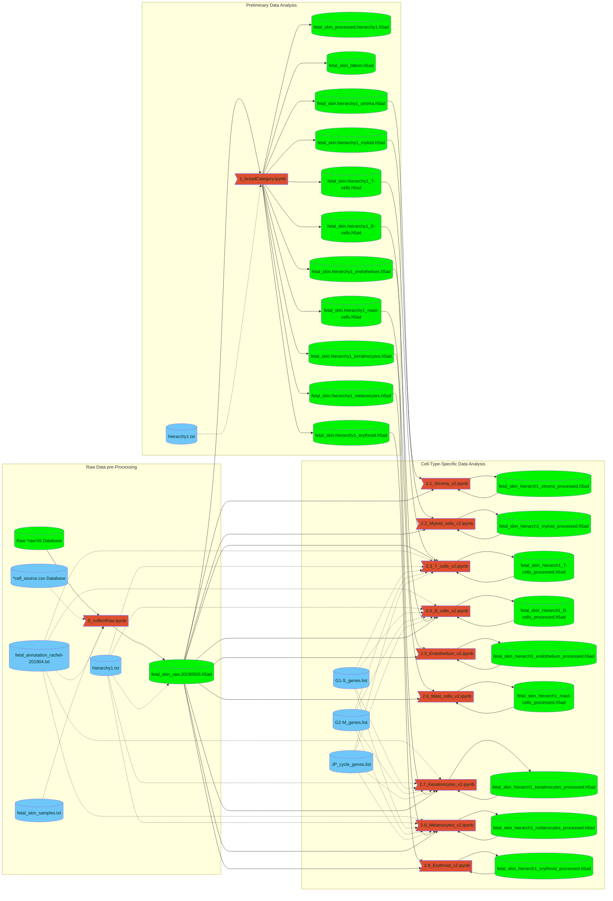

# FCA_Fetal_Skin_priv
Private repo for the preparation of the fetal skin manuscript

See [description of contents](toc.md)

## Data Science Pipeline

Click on the name of the file of interest to access it. 

